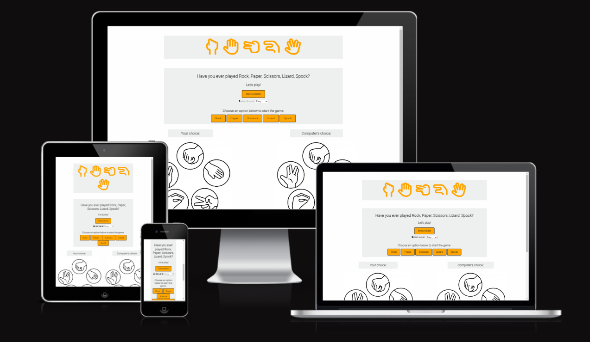
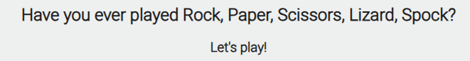
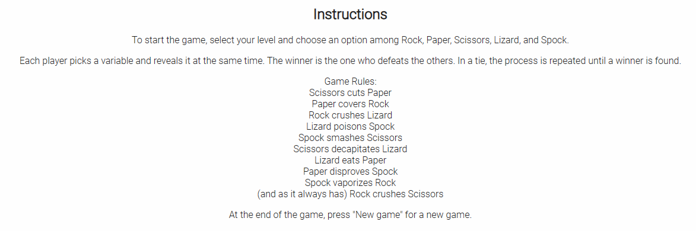
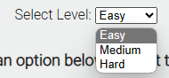
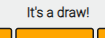
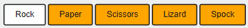
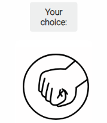
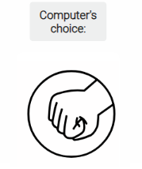
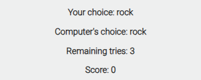
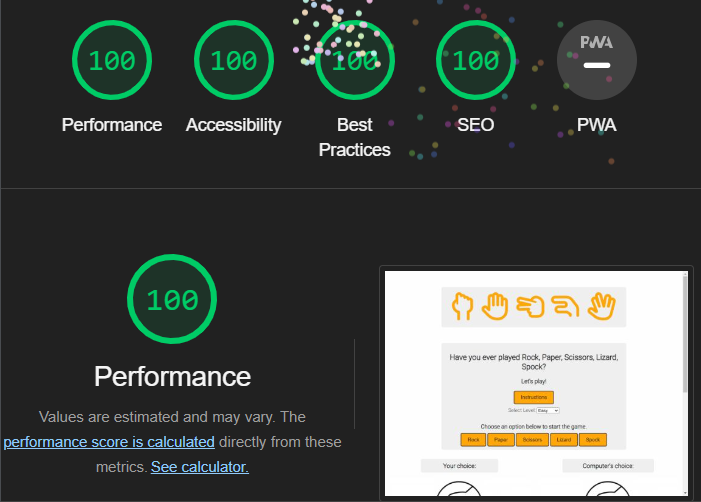

# Rock, Paper, Scissors, Lizard, Spock Game

Welcome to the Rock, Paper, Scissors, Lizard, Spock game! This web-based game offers an exciting twist on the classic Rock, Paper, Scissors game, featuring additional variables and a fun user interface.

## Table of Contents

- [Description](#description)
- [How to Play](#how-to-play)
- [Getting Started](#getting-started)
- [Game Features](#game-features)
- [Validation and Testing](#validation-and-testing)
- [Deployment](#deployment)
- [Contributing](#contributing)

## Description

### Main Game Interface

The main game interface is designed to provide an engaging and interactive gaming experience. Here's what you'll find:

- **Game Title**: A visually appealing game title featuring FontAwesome icons representing the game's variables: Rock, Paper, Scissors, Lizard, and Spock.

- **Game Instructions**: A brief introduction asking if you've ever played the game, enticing you to start the fun.

- **Instructions Button**: Clicking the "Instructions" button reveals a popup with detailed game rules and instructions on how to play.

- **Level Selection**: A dropdown menu allows you to select your desired level of difficulty: Easy, Medium, or Hard.

- **Game Result**: Displays the current game result message, instructing you to choose an option below to start the game.

- **Game Buttons**: Interactive buttons for selecting your choice among Rock, Paper, Scissors, Lizard, and Spock.

### Choices Display

Below the game interface, you'll find a section that displays your choices and the computer's choices in the form of images.

- **Your Choice**: Shows your selected choice along with an image representation.

- **Computer's Choice**: Displays the computer's choice along with an image representation.

### Game Stats

- **Your Choice**: Shows the choice you made during the current round.

- **Computer's Choice**: Displays the computer's choice for the current round.

- **Remaining Tries**: Indicates the number of remaining attempts in the game.

- **Score**: Keeps track of your score as you play.

### New Game Button

After completing a game or running out of tries, you can click the "New game" button to start a fresh game.

## How to Play

1. Click on the "Instructions" button to learn how to play the game, including game rules and instructions.

2. Select your desired level of difficulty (Easy, Medium, or Hard) from the dropdown menu.

3. Click on one of the interactive game buttons (Rock, Paper, Scissors, Lizard, or Spock) to make your choice.

4. The computer will randomly select its choice, and the game result will be displayed.

5. Keep playing and aim to win as many rounds as you can!

## Getting Started

This project is designed to run in modern web browsers and doesn't require any additional setup. Once the page loads, you can explore the game interface and start playing. Enjoy!

## Game Features

- Engaging and interactive game interface.
- Detailed game instructions.
- Multiple levels of difficulty to choose from.
- Visual representation of choices using images.
- Real-time display of game stats.
- Score tracking to challenge your skills.

## Validation and Testing

This project has undergone thorough validation and testing to ensure its reliability and adherence to coding standards. Here are the details of the validation and testing processes:

### Validation

The code in this project has been validated using various online validators to ensure compliance with web standards:

- **HTML (W3C Validator)**: I've validated my HTML code using the [W3C Markup Validation Service](https://validator.w3.org/). The code has been reviewed and conforms to the HTML5 standard without errors or warnings.

- **CSS (Jigsaw Validator)**: I've also validated my CSS code using the [Jigsaw CSS Validation Service](https://jigsaw.w3.org/css-validator/). The stylesheet is compliant with CSS3 standards and doesn't have any errors or issues.

- **JavaScript (JSHint Validator)**: The JavaScript code has been validated using [JSHint Online](https://jshint.com/).

   The JavaScript code analysis reveals the following insights:

   - There are 15 functions in this file.
   - Function with the largest signature takes 2 arguments, while the median is 0.
   - The largest function has 15 statements in it, while the median is 2.
   - The most complex function has a cyclomatic complexity value of 17, while the median is 1.

- **Accessibility:** I've taken accessibility seriously during the development of my website to ensure that it is usable by a wide range of users, including those with disabilities. Here are the steps I've taken:

## Deployment

The site was deployed to GitHub Pages. The steps to deploy are as follows:

1. **In the GitHub repository, navigate to the Settings tab.**
   
2. **From the source section drop-down menu, select the Master Branch.**
   
3. **Once the master branch has been selected, the page will be automatically refreshed with a detailed ribbon display to indicate the successful deployment.**

The live link can be found here - [Go to live website](https://lucaspbj.github.io/Project-milestone-2/)

## Contributing
### Image Credits

I would like to extend my gratitude to [JLChamberlain](https://github.com/JLChamberlain) for providing the amazing images used in this project. The images have greatly enhanced the visual appeal of the game and contributed to the overall user experience.

Please make sure to visit JLChamberlain's portfolio for more outstanding artwork and support their creative work.

### Acknowledgements

I would like to express my gratitude to the following individual who have contributed to the development of this project:

My mentor, Jack Wachira, for his invaluable guidance, feedback, and support throughout the project. His expertise and insights played a significant role in shaping the project's direction.

Thank you for your contributions and encouragement.

